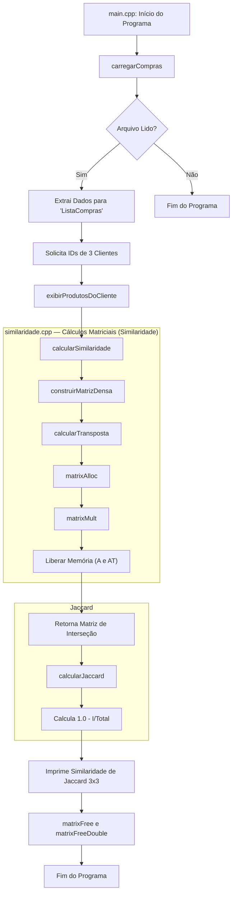

# Sistema de Recomendação - Similaridade de Jaccard

Este projeto implementa um sistema de recomendação baseado na **Similaridade de Jaccard**, analisando a interseção de compras entre clientes.

## Fluxo de Execução (Mermaid.js)

O diagrama a seguir detalha o fluxo de execução do sistema, desde a leitura do disco (`.csv`) até o processamento das matrizes em memória e a exibição em tela:

## Detalhamento das Funções por Arquivo

Abaixo encontra-se o detalhamento minucioso de toda a estrutura e funções, abordando assinaturas completas, tipos de parâmetros, uso de ponteiros explicativo e funcionamento de memória interna.

---

### 1. `listaCompras.hpp` / `listaCompras.cpp`

Este módulo é encarregado de extrair as informações base do `.csv` efetuando processamento primitivo das strings e indexação na memória.

#### struct `ListaCompras`

Uma estrutura que consolida toda a base lida:

- **`clientesCodigoBase`**: `std::vector<std::string>` - Armazena os códigos originais em formato de `string` pela ordem inserida. O índice da inserção representa dinamicamente o seu ID de cliente (inteiro).
- **`clienteIndiceInterno`**: `std::map<std::string, int>` - Relacionamento tipo chave-valor convertendo o código Original String do CSV na ID numérica do cliente no sistema.
- **`produtosNomeDescritivo`**: `std::vector<std::string>` - Mesmo princípio do vetor acima, porém para os nomes literais dos produtos; índice do vetor virando seu respectivo identificador ID numérico interno.
- **`produtoIndiceInterno`**: `std::map<std::string, int>` - Chave de busca em Hash Map transformando String nome de um item e indicando qual int ID pertence à ele.
- **`historicoComprasPorCliente`**: `std::vector<std::vector<int>>` - Matriz condensada que armazena os IDs dos produtos por IDs dos clientes.

#### Função: `carregarCompras`

A primeira função do fluxo do programa a ser invocada.

- **Assinatura**: `ListaCompras carregarCompras(const char *caminhoArquivo)`
- **Parâmetros**:
  - `caminhoArquivo`: (`const char *`) Ponteiro para o endereço de memória de caracteres constantes (strings estilo C). **Por que ser ponteiro?** É passado como ponteiro em substituição a `std::string` para acoplar nativamente sua variável ao método primitivo de leitura C-like `fopen(caminhoArquivo)`. Como é `const`, se assegura que esta string referida não poderá sofrer escritas colaterais da manipulação acidental durante a extração de metadados.
- **Retorno**: (`ListaCompras`) Um object struct instanciado contendo vetores e mapeamentos de IDs preenchido inteiramente. Ele não retorna ponteiro pois o objeto base se ancora perfeitamente pelo mecanismo RVO (Return Value Optimization) impedindo replicações brutas no contexto do pai.

---

### 2. `similaridade.hpp` / `similaridade.cpp`

Realiza conversões algébricas de estruturas aglomeradas do objeto `ListaCompras` em matrizes bidimensionais puras nativas em C via Heap da memória RAM, sem orientação a objeto extra, providenciando as bibliotecas vitais `<stdio.h>` e `<stdlib.h>`.

#### Funções: `matrixAlloc` / `matrixAllocDouble`

- **Assinatura**: `int** matrixAlloc(int linhas, int colunas)` / `double** matrixAllocDouble(...)`
- **Operação Principal**: Usando `malloc` combinada de repetição preenchedora e `calloc` com zeros absolutos geram as matrizes no bloco heap dinâmico da memória.
- **Parâmetros**:
  - `linhas` e `colunas`: (`int`) - **Tipo primário int repassado por valor.** São meramente cópias quantitativas pequenas iterativas de metainformação de laços temporários (for). Escritas acidentais nas variáveis ali dentro não prejudicam as matrizes principais do `main`.
- **Retorno**: (`int**` / `double**`) - Ponteiro referenciando para um outro ponteiro interno (`**`). **Por que isso ocorre?** Arrays multidimensionais em C que não têm seus tamanhos de "linhas" e "colunas" declarados em escopo e tempo de compilação precisam ser dinâmicos. `int**` significa que a variável central guarda endereços de memórias num *array mestre de ponteiros* onde cada endereço local dessa linha apontará para novo array contendo os "Inteiros" da tal coluna na lateral.

#### Funções: `matrixFree` / `matrixFreeDouble`

- **Assinatura**: `void matrixFree(int **matriz, int linhas)`
- **Operação Principal**: Função essencial para blindar a perda de memória e vazamento (Leak).
- **Parâmetros**:
  - `matriz`: (`int**` ou `double**`) - Recebe obrigatoriamente um ponteiro referenciado diretamente no nó-pai da memória estendida para soltar as amarrações do malloc.
  - `linhas`: (`int`) - Cópia repassada (por valor) de laço primário.

#### Função: `construirMatrizDensa`

- **Assinatura**: `int** construirMatrizDensa(ListaCompras *compras, int nClientes, int nProdutos)`
- **Operação Principal**: Gera matriz pura iterada da struct para calcular $A_{m \times n}$.
- **Parâmetros**:
  - `compras`: (`ListaCompras *`) - Uso intensivo de **ponteiro sem conversões const**. **Por que ponteiro?** Como `ListaCompras` tem milhões de hashes, structs em C passadas por valor como função seriam clonadas por cópia e gerariam excesso de alocação ram desnecessárias a fundo.
  - `nClientes`, `nProdutos`: (`int`) Valores base passados por cópia em variáveis limpas.
- **Retorno**: (`int**`) Ponteiro matricial instanciado da Matriz $A$.

#### Função: `calcularTransposta`

- **Assinatura**: `int** calcularTransposta(int **A, int nClientes, int nProdutos)`
- **Parâmetros**:
  - `A`: (`int**`) Referencia na memória a versão da matriz pura $A$ original; a ser inspecionada (não clonada).
  - Variáveis de controle for: Dimensões limitadoras por base valor numérico escalar.
- **Retorno**: (`int**`) Cria submatriz alocando na heap uma nova e limpa da qual se guarda $A^T$.

#### Função: `matrixMult`

- **Assinatura**: `void matrixMult(int **A, int **AT, int **I, int nClientes, int nProdutos)`
- **Operação Principal**: Pela algebra subscrita: $I = A \times A^T$.
- **Parâmetros**:
  - `A`, `AT`, `I`: (`int**`) Ponteiros duplos repassados em cascata a uma região alocadora de arrays instanciados previamente. A destinação não é por return final; **ela injeta em `I` perfeitamente em operação `in-place`**, ou seja, os valores das linhas multiplicadas preenchem as gavetas do bloco alocado pelo invocador lá no chamador primário, isentando de alocar ainda mais tráfego e memórias lixos.
  - Parametrizadores dimensionados escaláveis `int`.

#### Função: `calcularSimilaridade`

- **Assinatura**: `int** calcularSimilaridade(ListaCompras *compras, int *nClientes_out)`
- **Operação Principal**: A "Maestrina" que orquestra tudo isso de transpostas em modo limpo (gerando-as já as limpando localmente com matrixFree para poupar o main).
- **Parâmetros**:
  - `compras`: (`ListaCompras *`) Novamente por ponteiro por otimização extrema a estrutura macro do projeto.
  - `nClientes_out`: (`int *`) Ponteiro do Tipo Numérico Base. **Por que um ponteiro de int?** Sabendo que a função só permite um tipo único de return oficial (e a Matrix já usurpa esse espaço retornado como `int**`), é obrigatório o Main descobrir quantos laços terá que iterar mais tarde para apagar esse lixo inteiro; então forçadamente ele envia o ENDEREÇO NUMÉRICO de si mesmo `&nCliente_Out`, de forma que quando esta função de `Similaridade` atualiza a variável através do espaço subreferenciado que pertence a Main nativamente, escrevendo local permanentemente.
- **Retorno**: (`int**`) Matriz de Interseção já fechada e desanexada I.

#### Função: `calcularJaccard`

- **Assinatura**: `double** calcularJaccard(int **I, int nClientes)`
- **Parâmetros**:
  - `I`: (`int**`) Referência direta do ponteiro da matriz de matemática básica Intersecto já operante para se tornar as bases lógicas $1 - I/Total$.
  - `nClientes`: (`int`) Escala de for passada como cópia-valor.
- **Retorno**: (`double**`) Transmutação gerando outra Matriz Dinâmica Dupla de distanciamento flutuante decimal (0.0 até 1.0).

---

### 3. `main.cpp`

Orquestrador macro gerenciando IO streams locais.

#### Função: `exibirProdutosDoCliente`

- **Assinatura**: `static void exibirProdutosDoCliente(const ListaCompras *compras, const char *codigoCliente)`
- **Operação Principal**: Rotina varredora auxiliar (static=enclausurada apenas nesta listagem cpp não-pública a headers), ela converte os códigos String pra id_int indexador e localiza se aquele ID inserido visualizou/consumiu aquele vetor de IDs dos seus produtos.
- **Parâmetros**:
  - `compras`: (`const ListaCompras *`) O ponteiro ultra-leve sem cópia pra acesso RAM de raiz rápida. **Por que const?** Para certificar puramente de maneira compilável que não será de nenhum viés de escrita capaz de sobrescrever registros do Cliente por acidente, o qualificador restringe essa função a operações seguras em `Read-Only` na struct.
  - `codigoCliente`: (`const char *`) Buffer referenciado via ponteiro pois não necessita alocar os seus chars na memória, só compará-los iterativamente por hashes para agilidade em cima da query fornecida estritamente num `scanf`.

#### Função: `main`

- Processo que amarra a ponte `exibirProdutosDoCliente`, recolhe de fato as I/Os do buffer `stdin` com `scanf`, gerencia local as criações orquestradas `calcularSimilaridade` e imprime através de tabulações espaçadas limpas cruzadas um painel da nota transposta $S_{i,j}$ para o cliente, desativando os contadores dinâmicos através de `matrixFree(I)` e `matrixFreeDouble(S)` ao sair da run-time principal (Fim).
