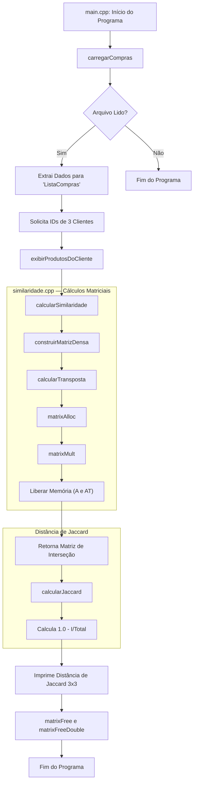

# Sistema de Recomendação - Distância de Jaccard

Este projeto implementa um sistema de recomendação baseado na **Distância de Jaccard**, utilizando o histórico de compras dos clientes para medir o grau de diferença entre seus perfis de consumo.

A proposta do sistema é transformar os registros de compras em estruturas numéricas que permitam comparar clientes de forma eficiente. Para isso, o programa identifica os produtos comprados por cada cliente, calcula a interseção entre esses conjuntos e, em seguida, aplica a métrica de Jaccard para obter uma matriz de distâncias entre os clientes analisados.

## Fluxo de Execução (Mermaid.js)

O diagrama abaixo apresenta o fluxo geral do sistema, desde a leitura do arquivo `.csv` até a construção das matrizes em memória, o cálculo da distância de Jaccard e a exibição dos resultados ao usuário.

## Detalhamento das Funções por Arquivo

A seguir, apresenta-se a descrição detalhada da estrutura do projeto e de suas principais funções, incluindo assinaturas, parâmetros, uso de ponteiros e estratégia de alocação de memória.

---

### 1. `listaCompras.hpp` / `listaCompras.cpp`

Esse módulo é responsável por ler o arquivo `.csv`, interpretar seus dados e organizá-los em estruturas de memória adequadas para o processamento posterior.

#### struct `ListaCompras`

A estrutura `ListaCompras` concentra toda a base de dados carregada do arquivo e funciona como núcleo de armazenamento do sistema.

- **`clientesCodigoBase`**: `std::vector<std::string>`  
  Armazena os códigos originais dos clientes na ordem em que são encontrados no arquivo. O índice de cada posição nesse vetor passa a funcionar como o identificador interno numérico do cliente.

- **`clienteIndiceInterno`**: `std::map<std::string, int>`  
  Mapeia o código textual do cliente, lido do `.csv`, para seu respectivo ID interno inteiro. Isso permite localizar rapidamente um cliente a partir de seu código original.

- **`produtosNomeDescritivo`**: `std::vector<std::string>`  
  Armazena os nomes dos produtos em ordem de inserção. Assim como no caso dos clientes, o índice de cada posição no vetor representa o ID interno do produto.

- **`produtoIndiceInterno`**: `std::map<std::string, int>`  
  Faz a associação entre o nome textual de um produto e seu identificador inteiro interno, facilitando o acesso rápido durante a leitura e o processamento.

- **`historicoComprasPorCliente`**: `std::vector<std::vector<int>>`  
  Armazena, para cada cliente, a lista dos IDs dos produtos comprados. Na prática, essa estrutura representa o histórico de compras já convertido para um formato mais apropriado ao cálculo matricial.

#### Função: `carregarCompras`

É a primeira função relevante do fluxo do programa, pois faz a leitura inicial da base de dados.

- **Assinatura**: `ListaCompras carregarCompras(const char *caminhoArquivo)`

- **Parâmetros**:
  - `caminhoArquivo`: (`const char *`)  
    Ponteiro para uma sequência de caracteres em estilo C que representa o caminho do arquivo de entrada. O uso de `const char *` é conveniente porque a função de abertura de arquivos em C, como `fopen`, trabalha naturalmente com esse formato. O modificador `const` garante que o conteúdo da string não será alterado durante a execução da função.

- **Retorno**:
  - (`ListaCompras`)  
    Retorna um objeto do tipo `ListaCompras` completamente preenchido com os dados extraídos do arquivo. O retorno é feito por valor, o que é aceitável em C++ moderno graças a otimizações como RVO (*Return Value Optimization*), reduzindo ou eliminando cópias desnecessárias.

---

### 2. `similaridade.hpp` / `similaridade.cpp`

Esse módulo concentra as operações matemáticas do sistema. Ele recebe os dados organizados em `ListaCompras`, converte essas informações em matrizes densas e executa os cálculos necessários para encontrar a interseção entre os conjuntos de compras e, depois, a distância de Jaccard.

Apesar do nome do arquivo e de algumas funções remeterem a “similaridade”, o resultado final utilizado pelo sistema é a **distância de Jaccard**, isto é, uma medida de dissimilaridade entre os conjuntos comparados.

#### Funções: `matrixAlloc` / `matrixAllocDouble`

Essas funções são responsáveis pela criação dinâmica de matrizes na heap.

- **Assinaturas**:  
  `int** matrixAlloc(int linhas, int colunas)`  
  `double** matrixAllocDouble(int linhas, int colunas)`

- **Operação principal**:  
  Criam, respectivamente, matrizes de inteiros e de números de ponto flutuante. A alocação é feita dinamicamente na heap, o que permite trabalhar com dimensões conhecidas apenas em tempo de execução.

- **Parâmetros**:
  - `linhas` e `colunas`: (`int`)  
    Representam as dimensões da matriz a ser criada. São passados por valor porque são apenas valores escalares pequenos, usados para controlar a alocação e os laços de preenchimento.

- **Retorno**:
  - (`int**` ou `double**`)  
    Retornam um ponteiro para ponteiro, que representa uma matriz alocada dinamicamente por linhas. Em outras palavras, há um vetor principal de ponteiros, e cada ponteiro desse vetor aponta para uma linha da matriz.

Esse modelo é comum em C quando se deseja criar matrizes com tamanho variável em tempo de execução.

#### Funções: `matrixFree` / `matrixFreeDouble`

Essas funções liberam a memória previamente alocada para as matrizes.

- **Assinatura**: `void matrixFree(int **matriz, int linhas)`  
  A função equivalente para `double` segue a mesma lógica.

- **Operação principal**:  
  Percorrem as linhas da matriz, liberando primeiro cada bloco correspondente a uma linha e, ao final, liberando o vetor principal de ponteiros.

- **Parâmetros**:
  - `matriz`: (`int**` ou `double**`)  
    Ponteiro para a matriz dinâmica que deverá ser desalocada.
  - `linhas`: (`int`)  
    Número de linhas da matriz, necessário para que a função saiba quantos blocos precisa liberar.

Essas funções são fundamentais para evitar vazamentos de memória ao final do processamento.

#### Função: `construirMatrizDensa`

Converte a estrutura lógica de compras em uma matriz binária cliente-produto.

- **Assinatura**: `int** construirMatrizDensa(ListaCompras *compras, int nClientes, int nProdutos)`

- **Operação principal**:  
  Gera a matriz \(A_{m \times n}\), em que cada linha representa um cliente e cada coluna representa um produto. O valor armazenado em cada posição indica se aquele cliente comprou ou não o produto correspondente.

- **Parâmetros**:
  - `compras`: (`ListaCompras *`)  
    Ponteiro para a estrutura principal do sistema. O uso de ponteiro evita a cópia completa da estrutura, o que seria custoso, já que ela contém vetores, mapas e histórico de compras.
  - `nClientes`, `nProdutos`: (`int`)  
    Dimensões necessárias para a criação da matriz.

- **Retorno**:
  - (`int**`)  
    Retorna a matriz densa \(A\), pronta para ser utilizada nos cálculos posteriores.

#### Função: `calcularTransposta`

Produz a transposta da matriz de compras.

- **Assinatura**: `int** calcularTransposta(int **A, int nClientes, int nProdutos)`

- **Operação principal**:  
  A partir da matriz original \(A\), constrói uma nova matriz \(A^T\), invertendo linhas e colunas. Essa etapa é importante porque a multiplicação entre \(A\) e \(A^T\) permite medir a interseção entre os conjuntos de compras dos clientes.

- **Parâmetros**:
  - `A`: (`int**`)  
    Matriz original de compras.
  - `nClientes`, `nProdutos`: (`int`)  
    Dimensões da matriz original.

- **Retorno**:
  - (`int**`)  
    Retorna uma nova matriz alocada dinamicamente contendo a transposta de `A`.

#### Função: `matrixMult`

Executa a multiplicação matricial principal do sistema.

- **Assinatura**: `void matrixMult(int **A, int **AT, int **I, int nClientes, int nProdutos)`

- **Operação principal**:  
  Calcula a matriz de interseção por meio da operação:

  \(I = A \times A^T\)

  O resultado `I` indica, para cada par de clientes, quantos produtos eles têm em comum.

- **Parâmetros**:
  - `A`, `AT`, `I`: (`int**`)  
    Matrizes envolvidas na operação. A matriz `I` já deve estar previamente alocada, pois a função escreve diretamente em suas posições.
  - `nClientes`, `nProdutos`: (`int`)  
    Dimensões necessárias para controlar os laços da multiplicação.

A escrita em `I` ocorre **in-place**, isto é, a função preenche uma estrutura já criada pelo chamador. Isso evita criar novas matrizes desnecessárias durante a multiplicação e reduz o custo de memória.

#### Função: `calcularSimilaridade`

Apesar do nome, essa função atua como coordenadora do cálculo da matriz de interseção, que depois servirá de base para a distância de Jaccard.

- **Assinatura**: `int** calcularSimilaridade(ListaCompras *compras, int *nClientes_out)`

- **Operação principal**:  
  Essa função organiza todo o processo intermediário de cálculo matricial. Em linhas gerais, ela:

  - determina as dimensões relevantes do problema;
  - constrói a matriz densa de compras;
  - calcula sua transposta;
  - aloca a matriz de interseção;
  - realiza a multiplicação matricial;
  - libera as matrizes intermediárias que não serão mais usadas;
  - retorna a matriz final de interseção.

- **Parâmetros**:
  - `compras`: (`ListaCompras *`)  
    Ponteiro para a estrutura principal com os dados de entrada.
  - `nClientes_out`: (`int *`)  
    Ponteiro para uma variável inteira do chamador. Ele é usado para que a função possa “devolver” ao `main` a quantidade de clientes processados, já que o valor de retorno principal da função é a matriz `int**`.

- **Retorno**:
  - (`int**`)  
    Retorna a matriz `I` de interseção entre clientes.

O uso de `int *nClientes_out` é uma técnica clássica em C e C++ para retornar uma informação adicional quando o retorno principal da função já está sendo utilizado por outro dado mais complexo.

#### Função: `calcularJaccard`

Calcula a matriz final de distâncias entre os clientes.

- **Assinatura**: `double** calcularJaccard(int **I, int nClientes)`

- **Operação principal**:  
  Recebe a matriz de interseção e, a partir dela, calcula a distância de Jaccard entre cada par de clientes. Como a distância de Jaccard é dada por \(1 - \frac{|A \cap B|}{|A \cup B|}\), o resultado expressa o quanto dois clientes diferem entre si [web:31][web:21].

- **Parâmetros**:
  - `I`: (`int**`)  
    Matriz de interseção entre os clientes.
  - `nClientes`: (`int`)  
    Quantidade de clientes considerada no cálculo.

- **Retorno**:
  - (`double**`)  
    Retorna uma matriz de números reais com valores entre 0.0 e 1.0, em que:
    - valores próximos de **0** indicam clientes com perfis de compra muito parecidos;
    - valores próximos de **1** indicam clientes com perfis de compra muito diferentes.

---

### 3. `main.cpp`

Esse arquivo atua como o ponto central de execução do programa. Ele coordena a leitura dos dados, a interação com o usuário, a chamada das rotinas de cálculo e a liberação da memória utilizada.

#### Função: `exibirProdutosDoCliente`

Mostra na tela os produtos associados a um cliente informado pelo usuário.

- **Assinatura**: `static void exibirProdutosDoCliente(const ListaCompras *compras, const char *codigoCliente)`

- **Operação principal**:  
  A função recebe o código de um cliente, localiza seu ID interno e percorre o histórico de compras correspondente para exibir os produtos associados a esse cliente.

- **Parâmetros**:
  - `compras`: (`const ListaCompras *`)  
    Ponteiro para a estrutura de dados principal. O uso de `const` indica que a função apenas consulta os dados, sem modificá-los.
  - `codigoCliente`: (`const char *`)  
    Código textual do cliente, recebido para consulta.

O uso de `static` indica que essa função é de uso interno ao arquivo `main.cpp`, não sendo exposta a outros módulos do projeto.

#### Função: `main`

A função `main` é a responsável por encadear todas as etapas da aplicação.

De forma geral, ela executa o seguinte fluxo:

1. chama `carregarCompras` para ler o arquivo e montar a estrutura principal;
2. solicita ao usuário os códigos de três clientes;
3. exibe os produtos comprados por cada cliente informado;
4. chama `calcularSimilaridade` para gerar a matriz de interseção;
5. chama `calcularJaccard` para obter a matriz de distância de Jaccard;
6. imprime a matriz resultante em formato tabular;
7. libera toda a memória dinâmica alocada durante a execução com `matrixFree` e `matrixFreeDouble`.

Assim, o `main` funciona como orquestrador do programa, conectando entrada, processamento, saída e gerenciamento de memória.
